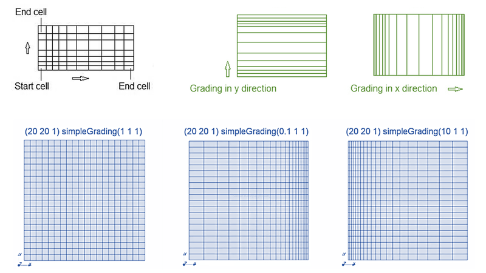

# Cavity
Fondamentalemnte lo schema 4x4 serve per raffinare in maniera uniforme la griglia vicino alle pareti, dove il gradiente è più incisivo.  
Per fare ciò, dovrò creare 9+9 = 18 vertici che definiscono i 4 quadrati sottili.  
Ricorda che per definire i quadrati uso la funzione hex, che sta per hexahedral. Per ulteriori info vedi https://www.openfoam.com/documentation/user-guide/4-mesh-generation-and-conversion/4.1-mesh-description  
Con il simple grading decido i rapporti fra le dimensioni delle celle e posso creare griglie più raffinate. Come funziona ? Ognuna delle 3 variabili indica una direzione e sono riferite sempre alla cella più avanti verso l'asse positivo. Quindi se voglio che le mie celle diventino sempre più fini fino a essere la metà di quelle iniziale sull'asse x, metto (0.5 1 1) e ora la cella più a sx sarà la più grande e quella a destra diventerà sempre più piccola fino a essere metà.  
  
Avendo solo una direzione di raffinamento, la divisione in 4 celle quadrate, mi permette di fare un raffinamento su tutta la parete, mentre con una cella sola avrei potuto farla solo su due lati.

## Reynolds alti
Tempo 2s, con time step di 0.02s, stampato ogni 20 iterazioni. Viscosità 0.0001, velocità 1 m/s e dimensione 0.1 m.  
  
Per fare come Ghia and Ghia adesso facciamo L = 1 m, U = 0.1 m/s e nu = 0,001. Nota che per mettere le dimensioni giuste ho tolto la variabile scale = 0.1 dal BlockMeshDict
